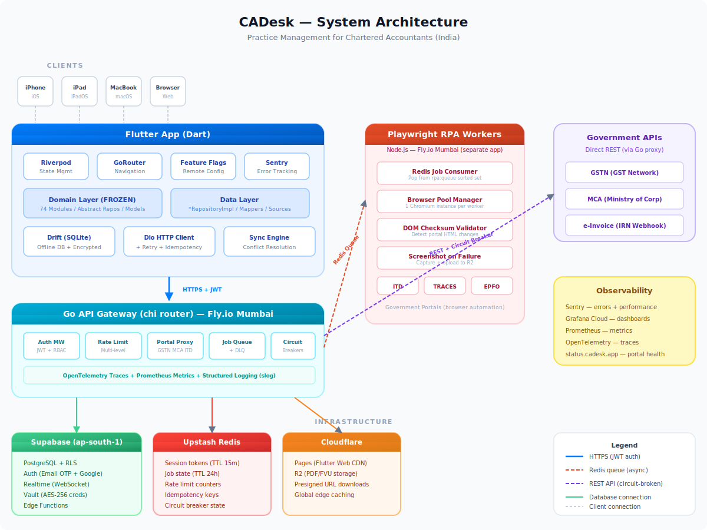
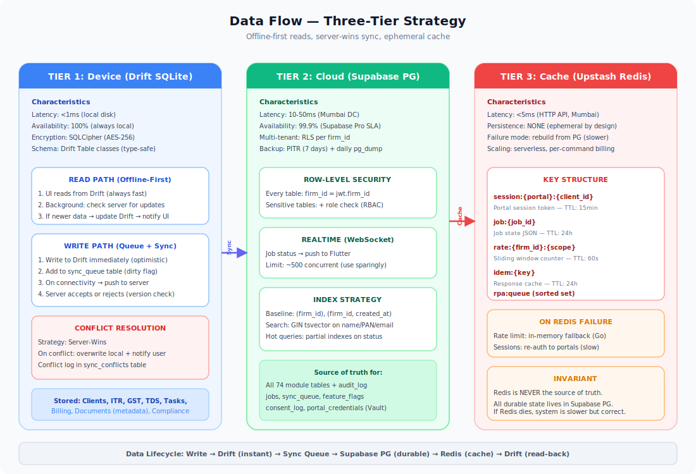
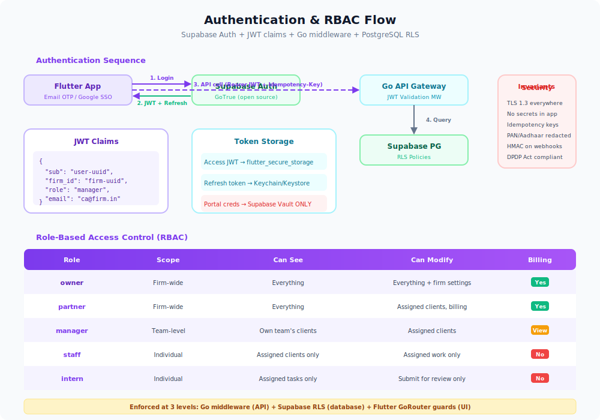
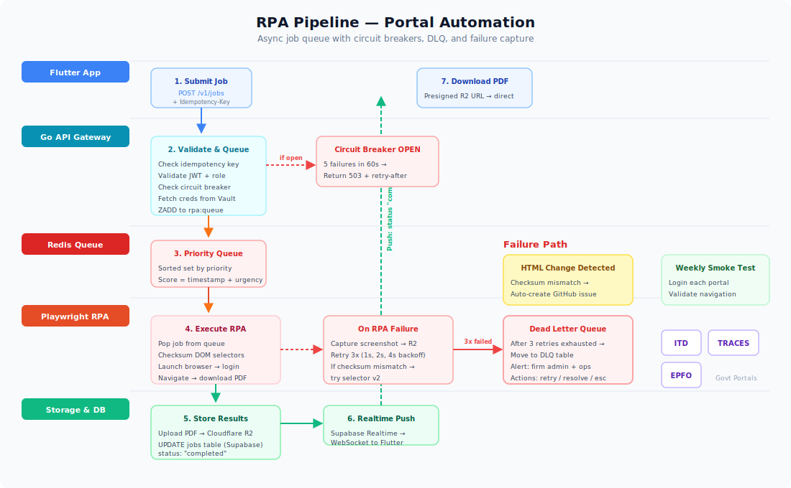
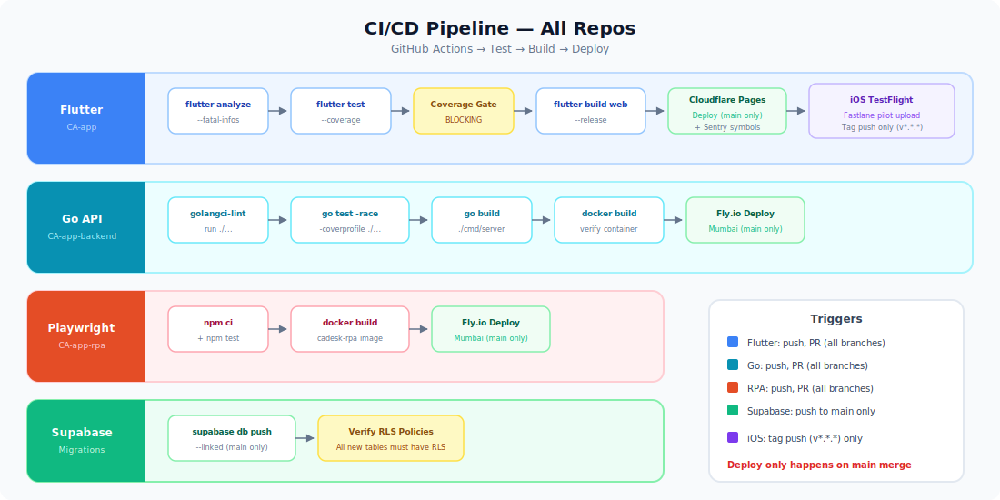
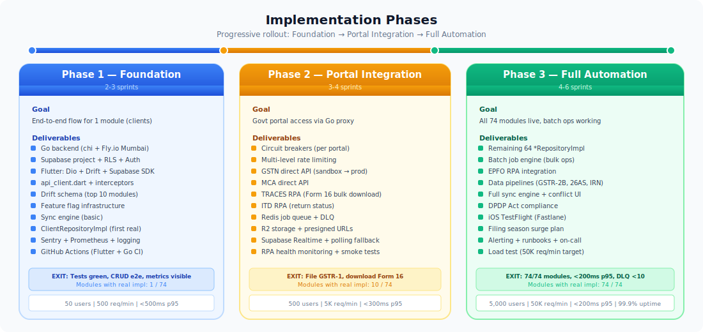

# CADesk Architecture Field Guide: From Spreadsheet Chaos to Swarm Cohesion

> _"Architecture is what happens when your weekend duct-tape hack accidentally lands 500+ CA firms overnight."_
>
> Grab a cup of chai. This book-ish blog will walk you from napkin sketches to the full-blown multi-cloud, RPA-assisted beast that is CADesk. We'll laugh at bad architecture, learn why it hurts, and then tour the real solution—complete with analogies, diagrams, and a few "don't be that firm" stories.

---

## 1. Chapter Zero: The Nightmare We Escaped

Imagine "CA & Sons," a 12-person tax practice that grew faster than its software. Their toolchain looked like this:

```
Excel v1.xlsx (2020)
Excel v1_final.xlsx (2020)
Excel v1_final_FINAL.xlsx (why?)
WhatsApp chat: "Hey did you e-file Sharma's ITR?" — "I think so?"
Downloads folder: gst-returns (1) (1) (FINAL) .zip
```

### Symptoms of Bad Architecture

| Symptom | Real-Life Consequence |
|---------|-----------------------|
| One giant database table called `clients` | When GSTN went down, all work stopped. No offline fallback. |
| Hardcoded portal passwords in config files | Auditor finds passwords in Git history. Panic ensues. |
| Polling loops with `setInterval` | API rate limits hit → portals ban IP → entire firm locked out. |
| "It works on my machine" builds | Actual quote during filing season. Managers cry softly. |
| No audit trail | TRACES notice arrives. Nobody knows who clicked "Submit." |

CADesk exists so you never need the file named `Form16_final_final_THIS_ONE.pdf` ever again.

---

## 2. Meet CADesk: The Offense Strategy



CADesk is split into three brains:

1. **Flutter App** – runs on iOS, Android, macOS, web. Offline-first, Riverpod state, Drift SQLite.
2. **Go API Gateway** – lives on Fly.io Mumbai. Handles auth, portal proxying, rate limits, job orchestration.
3. **Supabase & Friends** – PostgreSQL (ap-south-1), Upstash Redis, Cloudflare R2, RPA workers on Playwright.

Each brain is replaceable, independently scalable, and allergic to spaghetti.

### Real-Life Metaphor
- Flutter App = The CA's Field Notebook. Always with you, works on airplanes, syncs when it spots Wi-Fi.
- Go API = The Operations HQ. Guards front gates, logs every move, shouts when GSTN hiccups.
- Supabase & Co. = The Vault + Library. Secure records, versioned migrations, and the gossip log (audit trail).

---

## 3. Client Layer: Flutter with Street Smarts

### Offline-First Playbook
- **Drift SQLite** stores clients, filings, notices locally.
- Each row has `local_version`, `server_version`, `dirty` flags.
- Conflict resolution is "server wins" with human-friendly notifications: _"Manager Priya synced a newer return. Your draft was saved locally."_

### Riverpod State, GoRouter Nav
- Modular providers per feature (74 modules listed in `arc.md`).
- GoRouter drives tabbed navigation + deep links like `/filing/itr4/:jobId`.
- Feature modules stay pure domain → data → presentation. Domain layer already 100% implemented & TDD-certified (727 tests).

### Humor Check
If you try to sneak a network call inside a widget, the Architect Agent (see `.claude/plugins/.../architect-agent.md`) will gently materialize behind you with a lint stick.

---

## 4. Data Flow: How Information Walks



1. User taps "File ITR" on phone → Flutter logs action and stores local draft.
2. When online, it hits Go API via TLS 1.3, bearing a Supabase JWT + `Idempotency-Key` header.
3. Go API verifies JWT claims (`firm_id`, `role`), rate-limits by firm + portal, then queries Supabase PG.
4. Supabase enforces Row-Level Security (RLS) so staff only see assigned clients.
5. API responds, Flutter updates UI + Drift. If portals are needed, Go API hands the job off to the RPA queue.

**Why Idempotency Matters:** The same tap never files the same return twice. Even if the network burps.

---

## 5. Auth & RBAC: No More Shared Passwords on Stickies



- **Supabase Auth** handles Email OTP + Google SSO.
- JWT claims include `user_id`, `firm_id`, `role`.
- Roles: `owner`, `partner`, `manager`, `staff`, `intern` (like Hogwarts houses but with audit trails).
- Go middleware + RLS double-check every request. No role, no data.

**What happens if you bypass this?** Audit logs tattle. The Security Auditor agent spawns. Nobody wants that smoke.

---

## 6. RPA & Portal Automation: Herding Government Portals



### Stack
- **Playwright Workers** on Fly.io, separate app (`cadesk-rpa`). Each worker = 1 Chromium instance.
- **Upstash Redis Queue** stores jobs (`rpa:queue` sorted set by priority).
- **Circuit Breakers** per portal. If GSTN throws 5 errors/60s, breaker opens, API returns cached data + friendly "Portal busy" message.

### Failure Ritual
1. Capture screenshot → upload to Cloudflare R2.
2. Save HTML checksum. If DOM changes, flag script as `NEEDS_UPDATE`.
3. Drop job into Dead Letter Queue (DLQ) if it fails thrice.
4. Notify ops on Slack + auto-create GitHub issue.

Real-life analogy: It's like sending a patient intern to stand in line at the MCA office, but with screenshots, not samosas.

---

## 7. CI/CD & Deployment



### Flutter
- Build once, deploy everywhere via GitHub Actions.
- Web build pushed to Cloudflare Pages with cache-busting hashes.
- iOS/Android/macOS uploaded through respective stores.

### Go API & RPA
- Docker build → Fly.io deploy command: `fly deploy --app cadesk-api`.
- Health checks `/v1/admin/health`, readiness `/v1/admin/ready`.
- Auto-scaling: `min_machines_running = 1`, `max = 10`, concurrency-limited.

### Supabase
- Migration files under `supabase/migrations/` with naming `YYYYMMDDNNN_description.sql`.
- Rule of thumb from `arc.md`: never drop columns in prod; deprecate, wait 2 releases.

### Observability
- Sentry for crash/perf telemetry.
- Grafana Cloud (Tempo + Loki + Prometheus) for metrics/traces/logs.
- Alerts: API error >5%, RPA queue depth >50, DLQ >10, portal health fails.

---

## 8. Hosting & Scaling Strategy



| Layer | Platform | Region | Scaling Trick |
|-------|----------|--------|---------------|
| Flutter Web | Cloudflare Pages | Global | Edge cache + brotli |
| Go API | Fly.io | Mumbai | Horizontal auto-scale |
| RPA | Fly.io | Mumbai | Scale by Redis queue depth |
| PostgreSQL | Supabase Pro | ap-south-1 | Vertical + read replicas |
| Redis | Upstash | ap-south-1 | Consumption-based |
| R2 Storage | Cloudflare | ap-south-1 | Infinite, geo-restricted |

### Filing Season Surge Plan
1. 48h before deadline: pre-scale API to 5 machines, RPA to 10.
2. Circuit breakers warmed up; status page (`status.cadesk.app`) live.
3. Offline mode promoted in-app: "GSTN sleepy? Keep working, we'll sync." 
4. Bulk jobs queued overnight when portals calm down.

If all else fails, we still have the local Drift database. Accountants keep calm and continue reconciling.

---

## 9. Security, Compliance, and the DPDP 2023 Reality Check

- **Transport**: TLS 1.3 end-to-end.
- **Data at rest**: Supabase encryption + Drift via SQLCipher.
- **Consent logs**: `consent_log` table, explicit capture during onboarding.
- **Right to erasure**: `DELETE /v1/clients/{id}/data` cascades to R2 + PG.
- **Audit trail**: `audit_log` table with user, action, timestamp, IP.
- **Portal secrets**: Stored in Supabase Vault, decrypted per request, never logged.
- **Breach policy**: 72-hour notification pipeline via alerting + Ops runbook.

Bad architecture hides secrets in `.env` files checked into Git. Good architecture rotates keys and shreds secrets after use.

---

## 10. What If We Ignored Architecture?

| Bad Decision | Fallout | CADesk Antidote |
|--------------|---------|-----------------|
| Single server in US-East | 250ms latency to GSTN → captcha storms | Fly.io Mumbai + Cloudflare edge |
| Polling job status | Drains battery, portal bans | Supabase Realtime + fallback polling |
| Manual portal logins | Staff share passwords on WhatsApp | Vault + RPA + session TTL 15min |
| No idempotency | Double e-filing, duplicate challans | `Idempotency-Key` enforced in middleware |
| No DLQ | Failed jobs vanish | Supabase DLQ table + dashboards |

Architecture is empathy for future teammates (and your future self during tax season).

---

## 11. Bringing It All Together

1. **Start** with Supabase project (ap-south-1), set up roles + migrations.
2. **Deploy** Go API + RPA workers on Fly.io Mumbai.
3. **Configure** Upstash Redis, Cloudflare R2, Cloudflare Pages.
4. **Instrument** Sentry + Grafana for observability.
5. **Ship** Flutter apps per platform. Encourage `bd prime` before coding to load knowledge base facts.

Every piece of this architecture is documented in `arc.md`, enforced by the Metaswarm skills (Issue Orchestrator, Architect Agent, etc.), and visualized under `docs/architecture/`.

So the next time someone suggests "Let's just put everything in a single Firebase project," hand them this blog, slide over a samosa, and politely say: _"We already tried chaos. Let's scale with intention instead."_

Happy building!
